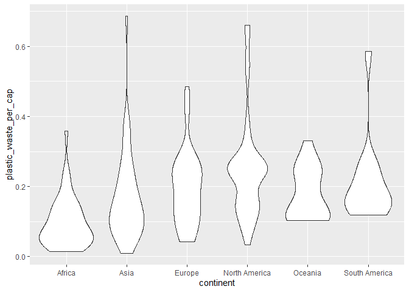

Lab 02 - Plastic waste
================
Léa Blais
15 septembre 2025

## Chargement des packages et des données

``` r
library(tidyverse) 
```

``` r
plastic_waste <- read_csv("data/plastic-waste.csv")
```

``` r
ggplot(data = plastic_waste, aes(x = plastic_waste_per_cap)) +
  geom_histogram(binwidth = 0.2)
```

    ## Warning: Removed 51 rows containing non-finite outside the scale range
    ## (`stat_bin()`).

<!-- --> Commençons
par filtrer les données pour retirer le point représenté par Trinité et
Tobago (TTO) qui est un outlier.

``` r
plastic_waste <- plastic_waste %>%
  filter(plastic_waste_per_cap < 3.5)
```

## Exercices

### Exercise 1

``` r
ggplot(plastic_waste, aes(x = plastic_waste_per_cap)) +
  geom_histogram(binwidth = 0.25) +
  facet_wrap(~ continent)
```

<!-- -->

### Exercise 2

``` r
ggplot(plastic_waste, aes(x = plastic_waste_per_cap)) +
  geom_density()
```

<!-- -->

``` r
ggplot(plastic_waste, aes(x = plastic_waste_per_cap, color = continent)) +
  geom_density()
```

<!-- -->

``` r
ggplot(plastic_waste, aes(x = plastic_waste_per_cap, color = continent, fill = continent)) +
  geom_density(alpha = 5)
```

<!-- -->

``` r
ggplot(plastic_waste, aes(x = plastic_waste_per_cap, color = continent, fill = continent)) +
  geom_density(alpha = 0.5)
```

<!-- -->

Réponse à la question: Le réglage de la couleur (color et fill) se
situent dans la région aes puisqu’elles sont en lien avec le mapping
initial du jeu de données voulues pour le graphique, en associant des
données à des propriétés. La transparence (alpha), quant à elle sert
plus à l’esthétique du graphique chosi lui-même. L’épaisseur des lignes
est une autre des caractéristiques visuelles réglées dans le
geom_density(). Ces caractéristiques ne sont pas liées avec des données,
mais seulement au visuel du graphique.

### Exercise 3

Boxplot:

``` r
ggplot(plastic_waste, aes(x = continent, y = plastic_waste_per_cap)) +
geom_boxplot()
```

<!-- -->

Violin plot:

``` r
ggplot(plastic_waste, aes(x = continent, y = plastic_waste_per_cap)) +
  geom_violin()
```

<!-- -->

Réponse à la question: Les violin plots permettent de voir la
distribution des données, ce que les boxplot n’offrent pas. En effet, on
voit mieux comment les données sont réparties

### Exercise 4

``` r
ggplot(plastic_waste, aes(x = plastic_waste_per_cap, y = mismanaged_plastic_waste_per_cap)) +
  geom_point()
```

<!-- -->
Réponse à la question: Ceux qui produisent plus de déchets, on une
meilleure gestion de ces derniers, tandis que ceux qui ont une
production moyenne de déchets ont une moins bonne gestion des déchets.

``` r
ggplot(plastic_waste, aes(x = plastic_waste_per_cap, y = mismanaged_plastic_waste_per_cap, color = continent)) +
  geom_point()
```

<!-- -->
Réponse à la question: Les pays plus développé tels que ceux d’amérique
du Nord et d’Europe ont eu meilleur gestion de déchets en moyenne tandis
que les pays moins développés tels que les pays d’Asie et d’Afrique ont
une bonne gestion. L’Amérique du Nord produit toutefois plus de déchets
que les autres continents en général.

### Exercise 5

``` r
ggplot(plastic_waste, aes(x = total_pop, y = plastic_waste_per_cap, color = continent)) +
  geom_point()
```

    ## Warning: Removed 10 rows containing missing values or values outside the scale range
    ## (`geom_point()`).

<!-- -->

``` r
ggplot(plastic_waste, aes(x = coastal_pop, y = plastic_waste_per_cap, color = continent)) +
  geom_point()
```

<!-- -->

Réponse à la question: Il semble avoir une relation plus forte dans le
deuxième graphique, soit netre la quantité de déchets plastiques par
habitant et la population côtière. En effet, il semble que plus la
population est grande, moins il y a de déchets.

## Conclusion

Recréez la visualisation:

``` r
plastic_waste_coastal <- plastic_waste %>% 
  mutate(coastal_pop_prop = coastal_pop / total_pop) %>% 
  filter(plastic_waste_per_cap < 3) 
```

``` r
ggplot(plastic_waste_coastal, aes(x = coastal_pop_prop, y = plastic_waste_per_cap, color = continent)) +
  geom_point() +
labs(title = "Quantité de déchet plastiques vs Proportion de la population côtière", subtitle = "Selon le continent", x = "Proportion de la population côtière (Coastal/total population)", y = "Nombre de déchets plastiques par habitant") +
  geom_smooth(aes(group = 1), method = "loess", color = "black", se = TRUE)
```

    ## `geom_smooth()` using formula = 'y ~ x'

    ## Warning: Removed 10 rows containing non-finite outside the scale range
    ## (`stat_smooth()`).

    ## Warning: Removed 10 rows containing missing values or values outside the scale range
    ## (`geom_point()`).

<!-- -->
